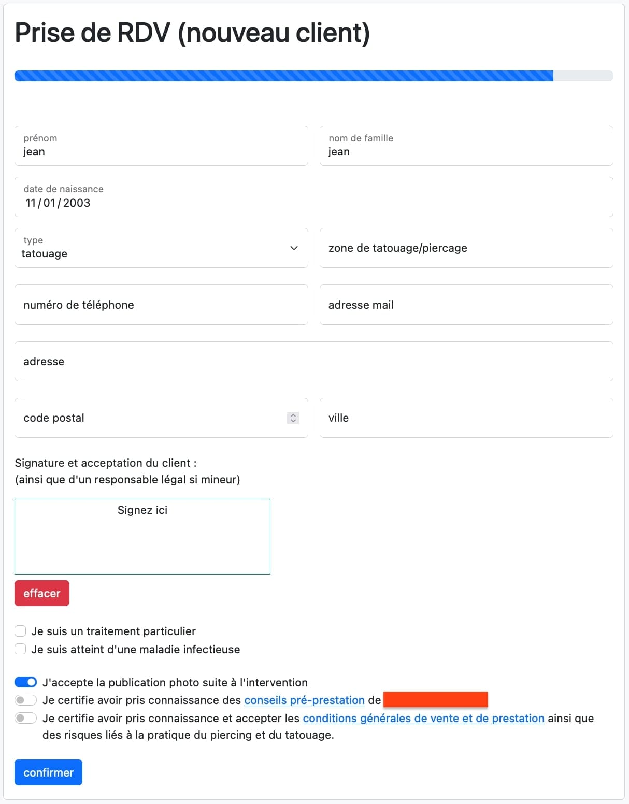

## Project

### Problem

The purpose of this software is to facilitate the management of a tattoo parlour. Whether it is administrative management, appointment management or accounting management.

It must replace "the appointment sheets" (sheets of paper completed by hand by the customer and summarizing all the information of the service).

This software had to be designed to be installed on an iPad fixed to the counter, so that customers could fill in directly on the latter.

### Description

This software therefore has two types of views:
* Customer part
* Administration part

The customer part allows the customer to pre-fill a form concerning his future service.

The administration part allows the manager of the salon to consult his appointments, to send his accounting summary to the accounting firm, to see his previous services...

### Technical details

* Main language: `PHP`
* PHP Framework: `Laravel`
* CSS and templating: `Bootstrap`, `Blade`
* Database: `MySQL`

## Customer part

The client part works with a "lock" feature.
As this part is freely accessible from an iPad, I had to ensure a minimum of security.
So I made sure that this form is accessible under two conditions:
* You are logged into the software as an administrator
* You have locked the account in client mode *(client mode allows you to not be able to exit this form without the pin code of the administrator)*

The service creation form is divided into 2 steps:
* customer identification
* creation of the service

### Identification

The identification of the customer is done via three discriminating information (*surname*, *first name*, *date of birth*) and makes it possible to check if the customer has already come to be tattooed / pierced in this salon.

### Creation of the service

The content of this form depends on whether you are a customer referenced in the database or not:
* if yes, you no longer have to enter your customer information
* if not, you will have to enter them once

If you are a former customer, only your signature, the type of service *(tattoo or piercing)*, as well as the area of the service will be requested.

If you are not yet a customer, in addition to the above information, you will be asked: your surname, first name, address, date of birth, telephone number, email address, any treatments and/or allergies.

### Follow-up by email

Once your service has been recorded, you can negotiate the price and date of the meeting with the manager.

Once this information has been completed by the latter. You will receive a confirmation email which will summarize all the information relating to your future performance as well as an email filled with instructions which will allow you to best prepare for the big day.

## Administrative part

The administration part contains different sections:
* Confirmation of appointments
* List of clients (with their past services)
* Use of time (piercing and tattooing)
* Accounting statement

### Confirmation of appointments

In the menu of the administration part, there is a list of all the services pre-filled by the customer, but not yet validated. Indeed, it lacks the information that can only be filled in by the administrator *(price, deposit, date of the appointment)*.

You will also find the services planned for the same day. Once marked as performed, an email will be sent to the client, with the post-service information essential for proper healing.

### Customer List

The administrator has the possibility of viewing the list of all the people who have already had a service in his room.

He can view all user account information, as well as all information relating to the customer's services.

He can also see the status of his services *(cancelled, validated)*

### Timetable

All the services recorded are formatted in a schedule, allowing the manager to easily visualize (by week) the services to come.

A color code is defined for the status of services:
* **green:** service performed
* **red:** service canceled
* **blue:** service to come

### Accounting statement

This section allows the manager to automatically declare his services to his accountant by email.

A summary table (with all the information requested by the accountant) will be sent to him in different formats (xls, html)