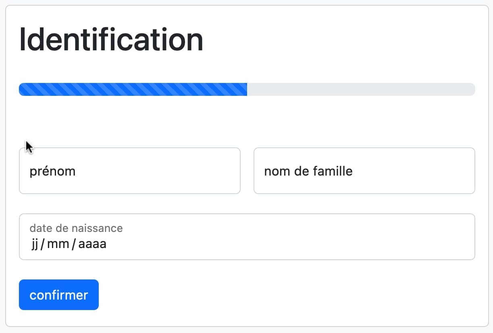

## Projet

### Problématique

Le but de ce logiciel est de faciliter la gestion d'un salon de tatouage. Que ce soit la gestion administrative, gestion des rendez-vous ou gestion de la comptabilité.

Il doit remplacer "les fiches rendez-vous" (feuilles de papier complétées à la main par le client et récapitulant toutes les informations de la prestation).

Ce logiciel devait dont être pensé pour être installé sur un iPad fixé au comptoir, afin que les clients puissent remplir directement sur ce dernier.

### Description

Ce logiciel possède donc deux types de vues : 
* Partie client
* Partie administration

La partie client permet au client de pré-remplir un formulaire concernant sa future prestation.

La partie administration permet au gérant du salon de consulter ses rendez-vous, d'envoyer son récapitulatif comptable au cabinet comptable, de voir ses précédents prestations ...

### Détails techniques

* Langage principal : `PHP`
* Framework PHP : `Laravel`
* CSS et templating : `Bootstrap`, `Blade`
* Base de données : `MySQL`

## Partie client

La partie client fonctionne avec une fonctionnalité de "verrou".
Comme cette partie est en libre accès depuis un iPad, j'ai dû assurer un minimum de sécurité.
J'ai donc fait en sorte que ce formulaire soit accessible à deux conditions :
* Vous êtes connecté sur le logiciel en tant qu'administrateur
* Vous avez verrouillé le compte en mode client *(le mode client permet de ne pas pouvoir sortir de ce formulaire sans le code pin de l'administrateur)*

Le formulaire de création de prestation est divisé en 2 étapes :
* identification du client
* création de la prestation

### Identification

L'identification du client se fait via trois informations discriminantes (*nom*, *prénom*, *date de naissance*) et permet de vérifier si le client est déjà venu se faire tatouer / percer dans ce salon.

### Création de la prestation

Le contenu de ce formulaire dépend de si vous êtes un client référencé en base de données ou non :
* si oui, vous n'avez plus à rentrer vos informations clientes
* si non, vous devrez les rentrer une première fois

Si vous êtes un ancien client, seul votre signature, le type de prestation *(tatouage ou piercing)*, ainsi que la zone de la prestation vous seront demandé.

Si vous n'êtes pas encore client, en plus des informations précédentes, vous seront demandées : votre nom, prénom, adresse, date de naissance, numéro de téléphone, adresse mail, vos éventuels traitements et/ou allergies.

### Suivi par mail

Une fois votre prestation enregistrée, vous pourrez négocier le prix et la date du rendez-vous avec le gérant. 

Une fois ces informations remplies par ce dernier. Vous recevrez un mail de confirmation qui va récapituler toutes les informations relatives à votre future prestation ainsi qu'un mail rempli de consignes qui vous permettra de vous préparer au mieux pour le jour J.

## Partie administration

La partie administration contient différentes sections : 
* Confirmation des rendez-vous
* Liste des clients (avec leurs prestations passées)
* Emploie du temps (piercing et tatouage)
* Déclaration comptable

### Confirmation des rendez-vous

Dans le menu de la partie administration se trouve une liste de toutes les prestations pré-emplie par le client, mais pas encore validée. En effet, il y manque les informations uniquement remplissable par l'administrateur *(prix, acompte, date du rendez-vous)*.

Vous y retrouverez également les prestations prévues pour le jour même. Une fois marquées comme effectuées, un mail sera envoyé au client, avec les informations post-prestations indispensables pour une bonne cicatrisation.

### Liste des clients

L'administrateur a la possibilité de visualiser la liste de toutes les personnes ayant déjà eu une prestation dans son salon. 

Il peut visualiser toutes les informations du compte utilisateur, ainsi que toutes les informations relatives aux prestations du client.

Il peut également voir le statut de ses prestations *(annulée, validée)*

### Emploi du temps

Toutes les prestations enregistrées sont mise en forme dans un emploi du temps, permettant au gérant de visualiser facilement (par semaine) les prestations à venir.

Un code couleur est défini pour le statut des prestations :
* **vert :** prestation effectuée
* **rouge :** prestation annulée
* **bleue :** prestation à venir

### Déclaration comptable

Cette section permet au gérant de déclarer automatiquement ses prestations à son expert comptable par mail.

Un tableau récapitulatif (avec toutes les informations demandées par le comptable) lui sera envoyé sous différents formats (xls, html)