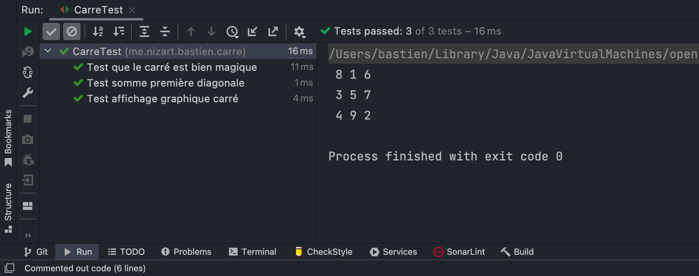
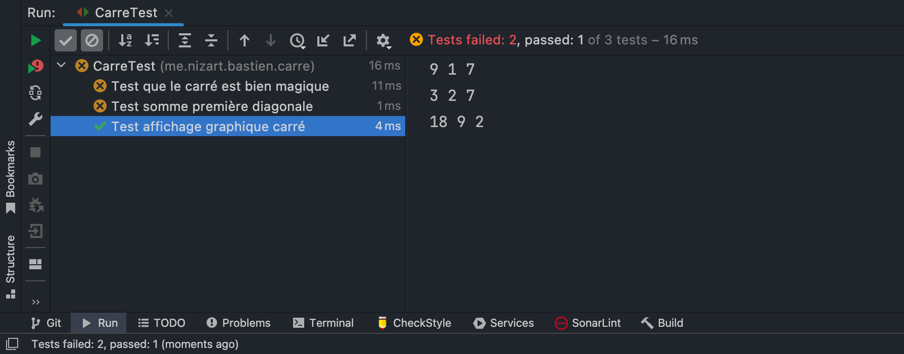

# Magic Square with JAVA

## Description

This small Java project allows you to create an object **Carre**.
Then check if the latter is a magic square or not.

## Technical description

* Language : Java
* Test : JUnit 5

## Magic Square Reminder 

A square is said to be a magic square if it meets two conditions:

- the sum of the diagonal numbers is equal to the sum of the column numbers. It itself is equal to the sum of the 
line numbers
- There are, in this size square **n**, all numbers between 1 and **n&#x00B2;**

## Use of the program

### Row

To generate the instance of a row, simply call its constructor
```java
Ligne row = new Ligne(int dimension, int[] values)
```
* dimension : the number of items in the row
* values : table of number (of size `dimension`) to insert in the row

### Square

To generate the instance of a square, simply call its constructor
```java
Carre square = new Carre(int dimension, Ligne[] rows)
```
* dimension : The length / width of the square
* rows : a row table

### Verification

To verify that the instance of a square is magic, simply call the `estMagique()' method on the instance of our square
```java
boolean result = square.estMagique()
```
* result : vrai si le carré est magique, sinon faux
* square : true if the square is magic, otherwise false

### Find the magic constant

The magic constant of a square of size `n` is the number to which the sum of rows, columns, and diagonals.

To find it from the program, no need to instantiate a square, just run a static method of the square class.
```java
Carre.trouverConstanteMagique(int dimension)
```
* dimension : The length / width of the square

## example of Use

### With a magic square

In this example, we will use the matrix : 

| 8 | 1 | 6 |
| - | - | - |
| 3 | 5 | 7 |
| 4 | 9 | 2 |

Which is a magic square with a magic constant is equal to `n = 15'

After creating a Carre object in our program, and providing it with the values of our matrix.
The test results are as follows: 



So we see that the program recognizes this square as a magic square.

### With a classic square

In this example, we will use the matrix :

| 9 | 1 | 7 |
| - | - | - |
| 3 | 2 | 7 |
| 18 | 9 | 2 |

Which is not a magic square and therefore has no magic constant.



So we see that the program recognizes this square as not a magic square.

## Acquired skills

* Math : I learned what a magic square was and a magic constant.
* Java : I manipulated the java language, as well as the JUnit 5 test library.