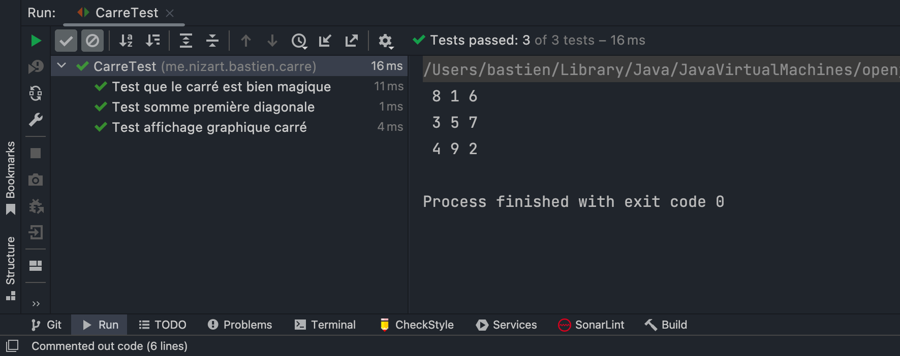

## Description

Ce petit projet JAVA permet de créer un objet **Carre**.
Puis de vérifier si ce dernier est un carré magique ou non.

## Description technique

* Langage : Java
* Test : JUnit 5

## Rappel Carré Magique 

On dit qu'un carré est un carré magique si ce dernier réuni deux conditions :

- la somme des nombres des diagonales est égale à la somme des nombres des colonnes. Elle-même égale à la somme des 
nombres d'une ligne
- Il existe, dans ce carré de taille **n**, tous les nombres compris entre 1 et **n&#x00B2;**

## Utilisation du programme

### Ligne

Pour générer l'instance d'une ligne, il suffit d'appeler son constructeur
```java
Ligne ligne = new Ligne(int dimension, int[] valeurs)
```
* dimension : le nombre d'éléments présent dans la ligne
* valeurs : tableau de nombre (de taille `dimension`) à insérer dans la ligne

### Carré

Pour générer l'instance d'un Carré, il suffit d'appeler son constructeur 
```java
Carre carre = new Carre(int dimension, Ligne[] lignes)
```
* dimension : La longueur / largeur du carré
* lignes : un tableau de ligne

### Vérification

Pour vérifier que l'instance d'un carré est magique, il suffit d'appeler la méthode `estMagique()` sur l'instance de 
notre carré
```java
boolean resultat = carre.estMagique()
```
* resultat : vrai si le carré est magique, sinon faux
* carre : notre instance d'un carré

### Trouver la constante magique

La constante magique d'un carré de taille `n` est le nombre auquel est égal la somme des lignes, des colonnes, des 
diagonales.

Pour la trouver à partir du programme, pas besoin d'instancier un carré, il suffit d'exécuter une méthode statique de
la classe carré.
```java
Carre.trouverConstanteMagique(int dimension)
```
* dimension : La longueur / largeur du carré

## Exemple d'utilisation

### Avec un carré magique

Dans cet exemple, nous utiliserons la matrice : 

| 8 | 1 | 6 |
| - | - | - |
| 3 | 5 | 7 |
| 4 | 9 | 2 |

Qui est un carré magique de constante magique `n = 15`

Après avoir créé un objet du type `Carre` dans notre programme, et lui avoir fourni les valeurs de notre matrice.
Les résultats des tests sont les suivants : 



Nous voyons donc que le programme reconnaît ce carré comme étant un carré magique.

### Avec un carré classique

Dans cet exemple, nous utiliserons la matrice : 

| 9 | 1 | 7 |
| - | - | - |
| 3 | 2 | 7 |
| 18 | 9 | 2 |

Qui n'est pas un carré magique et n'a donc pas de constante magique.


Nous voyons donc que le programme reconnaît ce carré comme n'étant pas un carré magique.

## Compétences acquises

* Math : J'ai appris ce qu'était un carré magique ainsi qu'une constante magique.
* Java : J'ai manipulé le langage java, ainsi que la librairie de test JUnit 5.