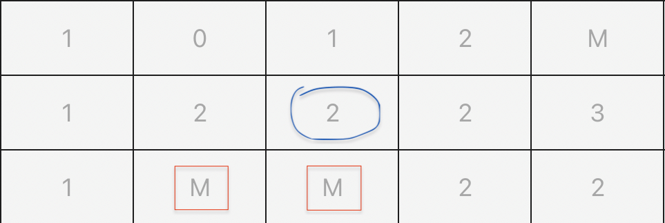
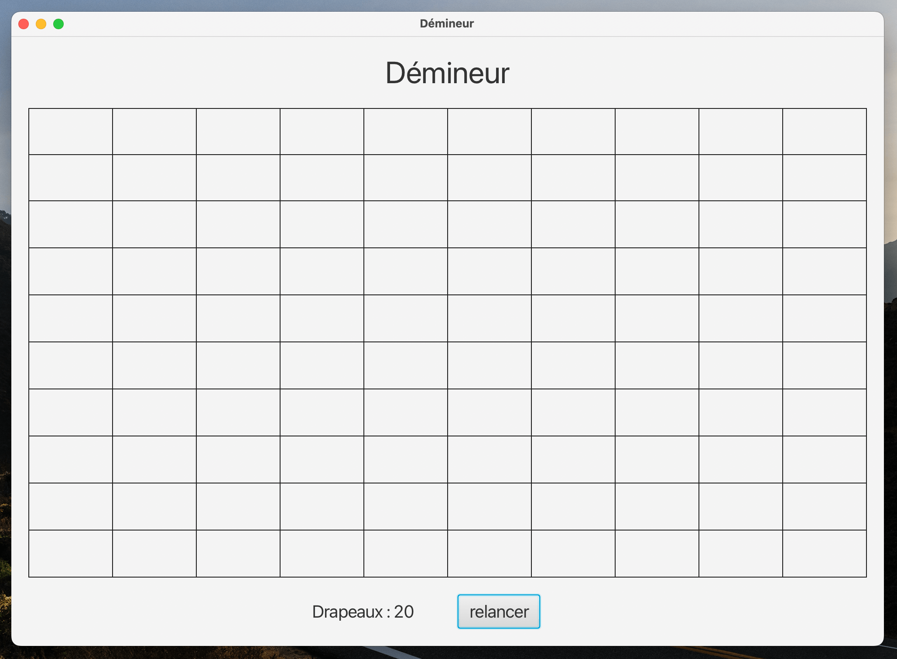

# Minesweeper with JAVA

## Description

This java program allows you to run a Minesweeper game made in JAVA with the JavaFX graphical library.
The program is very light, no image is used *(a flag is represented by the letter D, while a mine will be represented by the letter M)*.

## Technical details

* java version : 18
* library manager : gradle
* test library : JUnit 5

## The rules of the minesweeper

Based on Wikipedia :
> Minesweeper is a single-player puzzle video game. The objective of the game is to clear a rectangular board containing hidden "mines" or bombs without detonating any of them, with help from clues about the number of neighboring mines in each field. 

Indeed, the game is played on a grid, whose content of each box is initially hidden.
A click on a box reveals its content. And from there, 2 possible results:
- the box contains a mine (marked M in my version), you have lost.
- the box contains a number (between 0 and 8), which corresponds to the number of boxes next to ours containing a mine.



In this example, the box surrounded in blue contains the number 2, because it has two neighbors containing a mine (framed in red).

You can also place flags (right click on my version of the game) on a box whose contents you suspect is a mine.

The goal of the game is to discover all the boxes of the board, without falling on a mine, and by marking them with a flag.

## Use of the program

To start the game, simply download the sources *(available on [GitHub](https://github.com/bastien-nizart/DemineurJava))* and compile them with gradle.

I use personally as an IntelliJ IDE, but you can also run my code with any IDE.

Once compiled and launched, a grid with a few other elements appears. The size of this grid only depends on the `DIMENSION` constant of the `Demineur` class which is by default equal to 10 *(so 10\*10 = 100 boxes)*

```java
public static final int DIMENSION = 10;
```



At the bottom of this grid is a "relaunch" button that allows you to start a game from scratch at any time. 

As well as right next to it writes the number of flags you have left to pose. *(There are as many flags as there are mines on the plateau. The number of mines represents 20% of the number of boxes on the plateau.)*