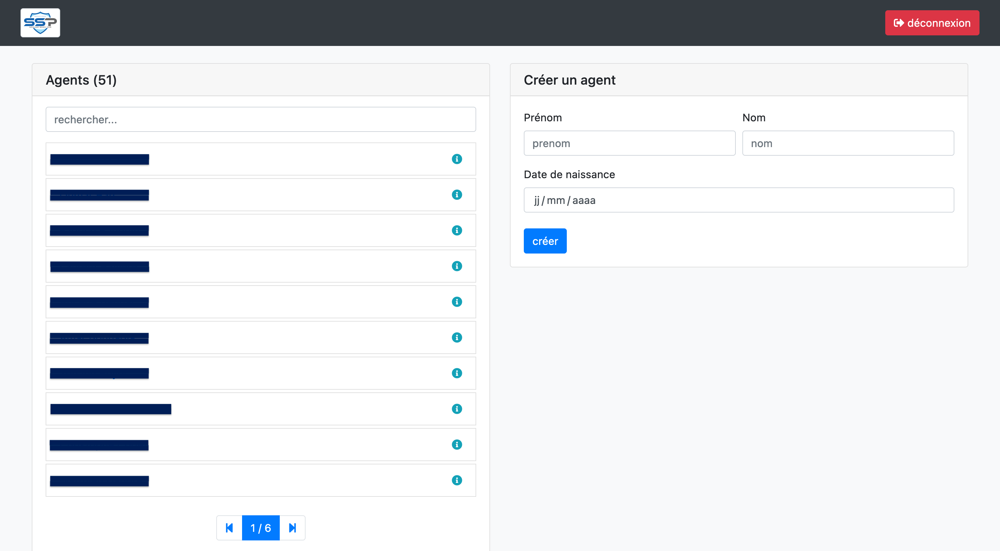
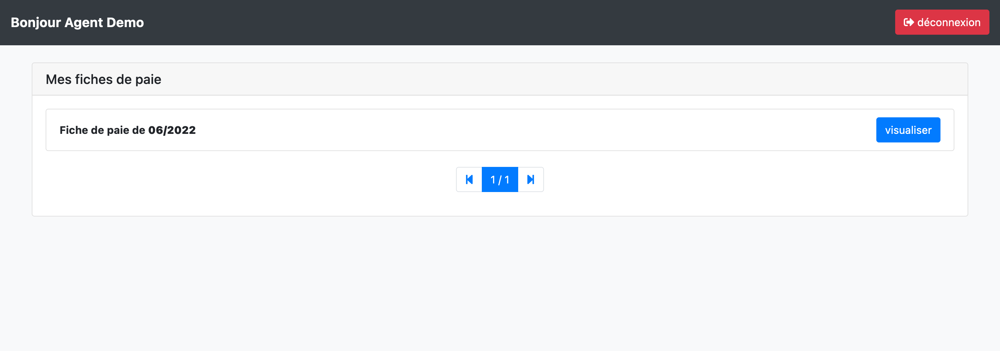

# Payroll Management Software

## Description

This software therefore allows an administrator account (person involved in the distribution of payroll to employees within the company) to create an account for each employee, and to add his or her payroll records. 

Thus, each employee with online access has the history of his pay sheets that he can download/ consult.

The software is therefore composed of two types of views:
* The administration part 
* The employee part

## Technical details

* Principal language : `PHP`
* Framework PHP : `internal company framework`
* Framework CSS : `Bootstrap`
* Database : `MySQL`

## Problem

The software was created in order to facilitate/ speed up the sending of payslips to employees.

Indeed, it was designed for a large company, with a lot of employees whose payslips were sent by mail one by one and store locally on a hard drive (obligation to keep them). 

The goal was therefore to create a platform on which payslips would be saved, and searchable at any time.

## Administration panel

This part of the software allows the administrator to manage all aspects of the software.

Employees can be added to the database here (where to use employees already existing and added from other software of the administration suite). 
Once the employees have been added, several operations can be performed on them.

We see here that we can: 
* remove an employee
* change your password if you forget
* add a pay slip

The re-generate password is displayed in this way :

Adding a pay slip is very simple. Simply date and then deposit the pay slip in pdf format

## Employee panel

This part is much more sober, it allows the employee to view the complete history of his payslips or to download them.

