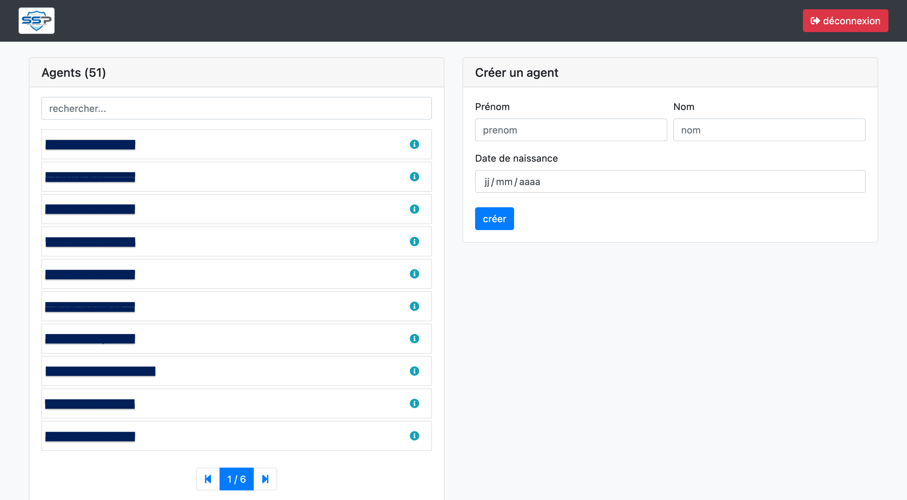
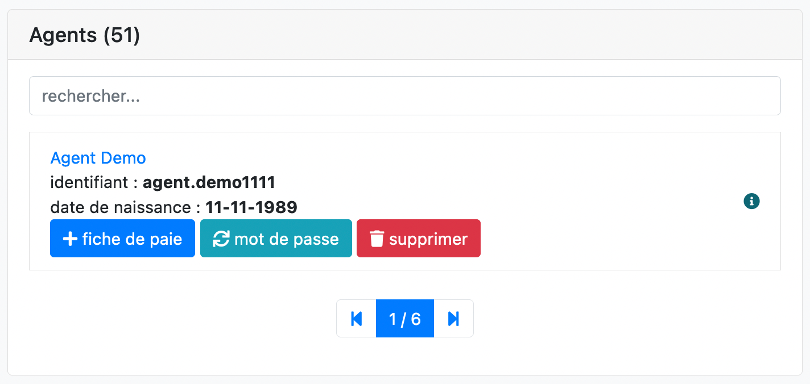
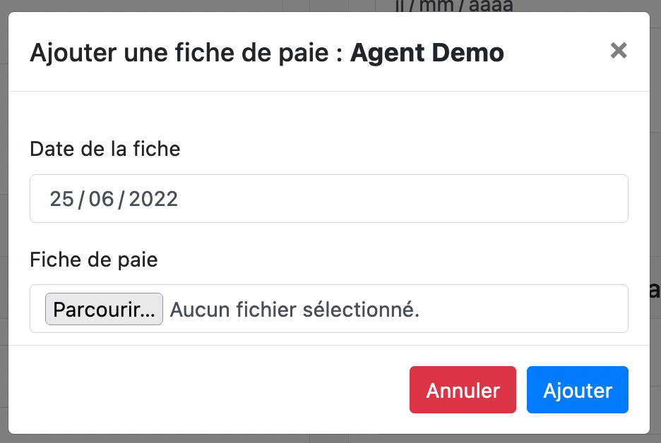
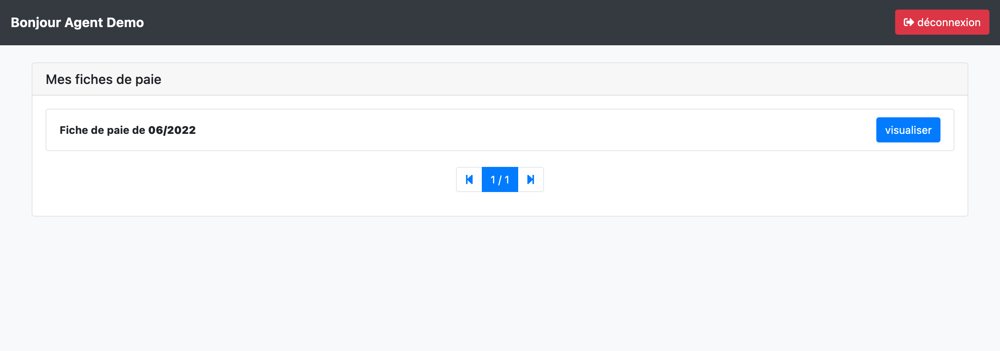

## Description

Ce logiciel permet donc à un compte administrateur (personne s’occupant au sein de l’entreprise de la distribution des paies aux salariés) de créer un compte pour chaque salarié, et de lui ajouter ses fiches de paies. 

Ainsi, chaque salarié à accès en ligne a l’historique de ses fiches de paies qu’il peut télécharger / consulter.

Le logiciel est donc composé de deux types de vues :
* La partie administration 
* La partie salariée

## Détails techniques

* Langage principal : `PHP`
* Framework PHP : `framework interne à l'entreprise`
* Framework CSS : `Bootstrap`
* Base de données : `MySQL`

## Problématique

Le logiciel a été créé dans le but de faciliter / accélérer l’envoi des fiches de paies aux salariés.

En effet, il a été conçu pour une grosse société, avec beaucoup de salariés dont les fiches de paies été envoyées par mail une a une et stocker en local sur un disque dur (obligation de les conserver). 

Le but était donc de créer une plateforme sur laquelle les fiches de paies seraient sauvegardées, et consultable a n’importe quel moment.

## Partie administration

Cette partie du logiciel permet à l'administrateur de gérer tous les aspects du logiciel.

On peut ici ajouter des salariés à la base de données (où utiliser les salariés déjà existant et ajouté depuis d'autre logiciels de la suite d'administration). 
Une fois les salariés ajoutés, on peut effectuer plusieurs opérations sur ces derniers.

On voit ici que l'on peut : 
* supprimer un salarié
* modifier son mot de passe en cas d'oubli
* lui ajouter une fiche de paie

Le mot de passe re-généré s'affiche de cette manière :

L'ajout d'une fiche de paies est lui très simple. Il suffit de dater, puis déposer la fiche de paie au format pdf

## Partie employé

Cette partie est beaucoup plus sobre, elle permet au salarié de visualiser l'historique complet de ses fiches de paies ou encore de les télécharger.

