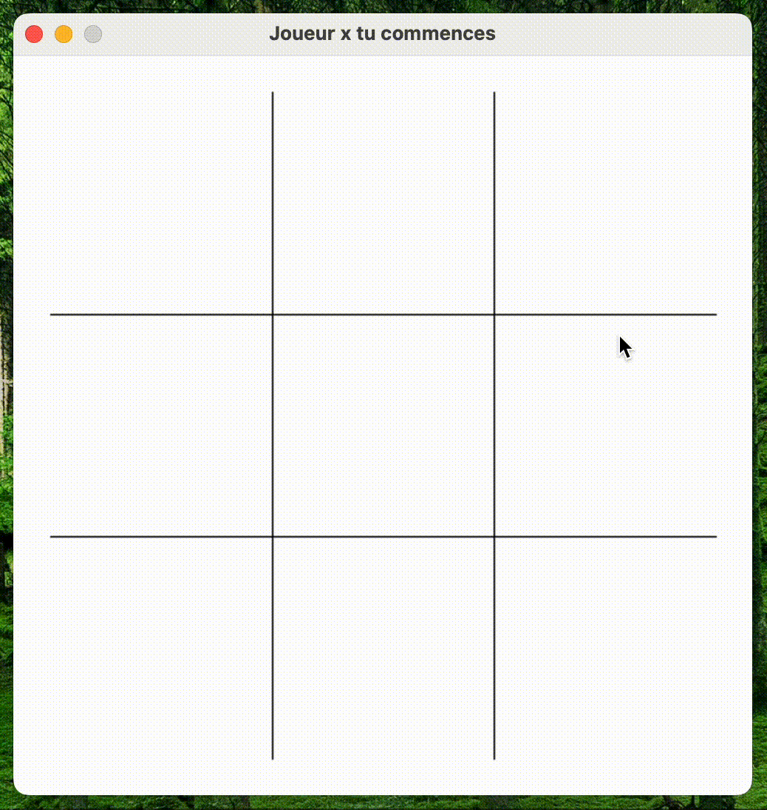

This project is a noughts and crosses game developed in python using the pygame library. It allows to play with exactly two players



## Goal 

The goal here was to create a copy of the game tictactoe using the PyGame library to handle it.

I tried to use as few sprites as possible (the board is drawn by PyGame) to weigh down the program as little as possible.

All sources are available [here](https://github.com/bastien-nizart/tictactoe-pygame)

## Project Architecture

```
├── assets
│   ├── circle.png
│   └── cross.png
├── app
│   ├── const.py
│   ├── player.py
│   └── game.py
├── main.py
└── requirements.txt

```

- `/assets` contains the different sprites of the game
- `main.py` contains the global launch of the program
- `/app/const.py` contains all the project constants
- `/app/game.py` contains methods to run the game
- `/app/player.py` contains the class representing a player in the game

## Code

### Constants

The `const.py` file contains two types of constants:
- Colors
- General constants

Four colors are required at launch, *(white, black, red, blue)*

To add another, just add a parameter in the `Color` enum
the color code is a tuple in rgb format. Example :

```python
class Color(Enum):
    COLOR = (231, 242, 0)
```

The two main constants are:
```python
class Game(Enum):
    SCREEN_SIZE = 500
    TOKEN_POSITION = [
        [(50, 50), (200, 50), (350, 50)],
        [(50, 200), (200, 200), (350, 200)],
        [(50, 350), (200, 350), (350, 350)]
    ]
```

They represent :
- ``SCREEN_SIZE`` the size of the window *(in pixels)*
- `TOKEN_POSITION` the different position of the sprites on the board

### Players

Players are represented by a player class. Can be instantiated using:

- *of a name* composed of a single character of preference
- *a sprite* to represent the player on the board

Example of instantiation:

```python
players[0] = Player('y', './assets/circle.png')
```

## Program adaptability

It is possible to simply modify the program:

- the **addition of sprite** can be done by placing your image *(size 1/5 of the window)* directly in the `assets/` folder
- to **modify the size of the application** you just have to modify the constants `Game.SCREEN_SIZE` and `Game.TOKEN_POSITION` *(taking care to keep values proportional to the original values)*