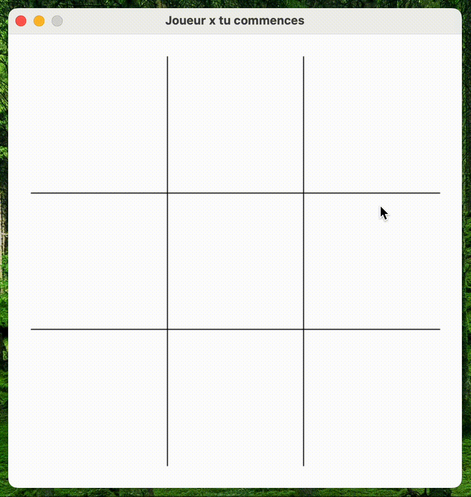

Ce projet est un jeu de morpion développé en python à l'aide de la bibliothèque *pygame*.
Il permet de joueur avec exactement deux joueurs



## Objectif 

Le but ici était de créer une copie du jeu tictactoe **(morpion)** en utilisant la librairie PyGame pour prendre en main cette dernière.

J'ai essayé d'utiliser le moins de sprite possible (le plateau est tracé par PyGame) pour alourdir le moins possible le programme.

Toutes les sources sont disponibles [ici](https://github.com/bastien-nizart/tictactoe-pygame)

## Architecture du projet

```
├── assets
│   ├── circle.png
│   └── cross.png
├── app
│   ├── const.py
│   ├── player.py
│   └── game.py
├── main.py
└── requirements.txt

```

- `/assets` contient les différents sprites du jeu
- `main.py` contient le lancement global du programme
- `/app/const.py` contient l'ensemble des constantes du projet
- `/app/game.py` contient les méthodes permettant de faire fonctionner le jeu
- `/app/player.py`contient la classe représentant un joueur dans la partie

## Code

### Constantes

Le fichier `const.py` contient deux types de constantes :
- Les couleurs
- Les constantes générales

Quatre couleurs sont nécessaires au lancement, *(blanc, noir, rouge, bleu)*

Pour en rajouter d'autre il suffit de rajouter un paramètre dans l'enum `Color`
le code couleur est un tuple au format rgb. Exemple :

```python
class Color(Enum):
    COLOR = (231, 242, 0)
```

Les quatre constantes générales sont :
```python
class Game(Enum):
    SCREEN_SIZE = 500
    TOKEN_POSITION = [
        [(50, 50), (200, 50), (350, 50)],
        [(50, 200), (200, 200), (350, 200)],
        [(50, 350), (200, 350), (350, 350)]
    ]
```

Elles représentent :
- ``SCREEN_SIZE`` la taille de la fenêtre *(en pixel)*
- `TOKEN_POSITION` la différente position des sprites sur le plateau

### Joueurs

Les joueurs sont représentés par une classe player. Pouvant s'instancier à l'aide :

- *d'un nom* composé d'un unique caractère de préférence
- *d'un sprite* permettant de représenter le joueur sur le plateau

Exemple d'instanciation :

```python
players[0] = Player('y', './assets/circle.png')
```

## Adaptabilité du programme

Il est possible de modifier simplement le programme :

- l'**ajout de sprite** peut se faire en plaçant votre image *(taille 1/5 de la fenêtre)* directement dans le dossier `assets/`
- pour **modifier la taille de l'application** il vous suffit de modifier les constantes `Game.SCREEN_SIZE` et `Game.TOKEN_POSITION` *(en veillant à garder des valeurs proportionnelles aux valeurs d'origine)*