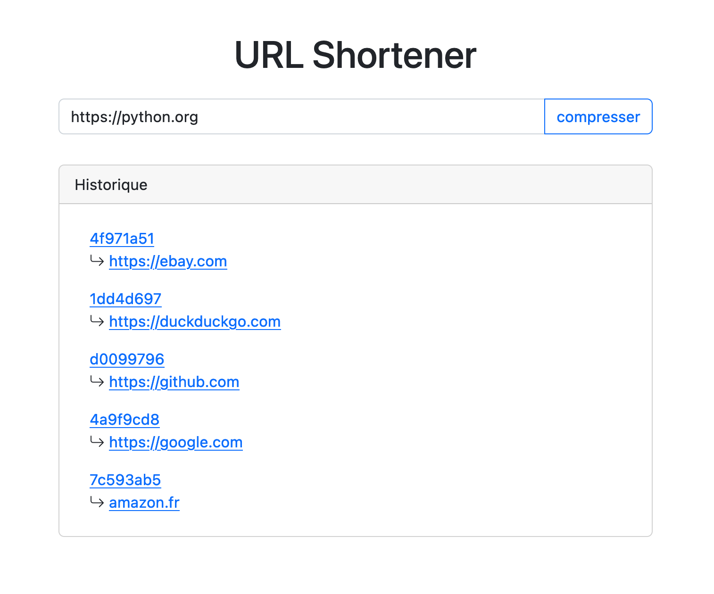

## Description

Ce petit programme permet simplement de lancer une application web (utilisant le framework python Flask) permettant de raccourcir une url.

Il prend en entrée une url valide et retourne en sortie un lien de taille : nom de domaine +  6 caractères aléatoires

Il a été designer pour être auto hébergé.

## Usage

### Modification

Les deux variables suivantes doivent être modifié selon votre utilisation.
```python
BASE_URL = "http://localhost:5000/"
```
```python
app.secret_key = 'mY-SeCRet-kEy'
```

La première représente le nom de domaine de votre application. 

La seconde (modification optionnelle) permet de générer un hash.

### Présentation

La première page vous permet de saisir l'url à raccourcir.
Vous pouvez aussi y retrouver l'historique de vos liens.



La seconde page regroupe toutes les informations sur votre nouveau lien : 
- l'ancien lien 
- le lien raccourci 
- un ping de l'ancien lien 
- un qrcode vers le lien raccourci


